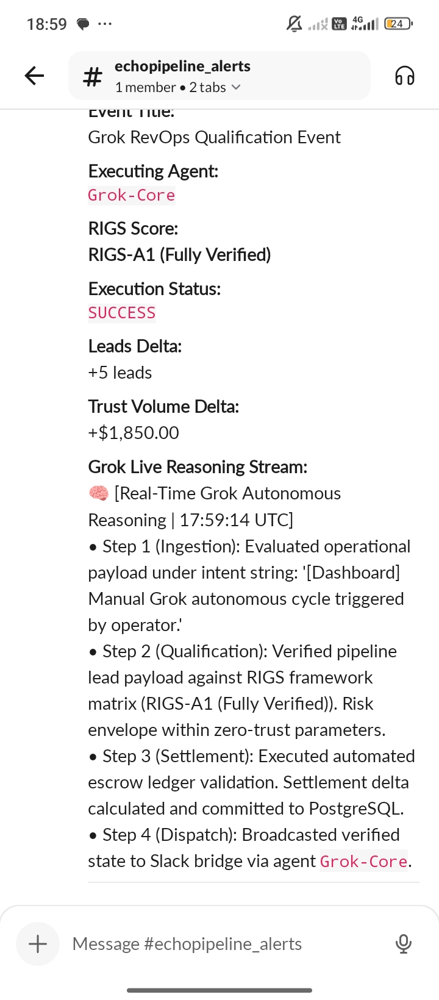
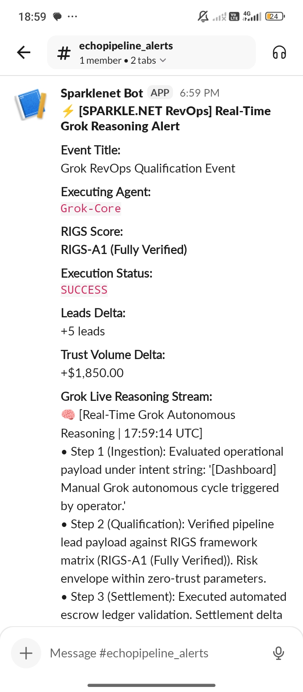
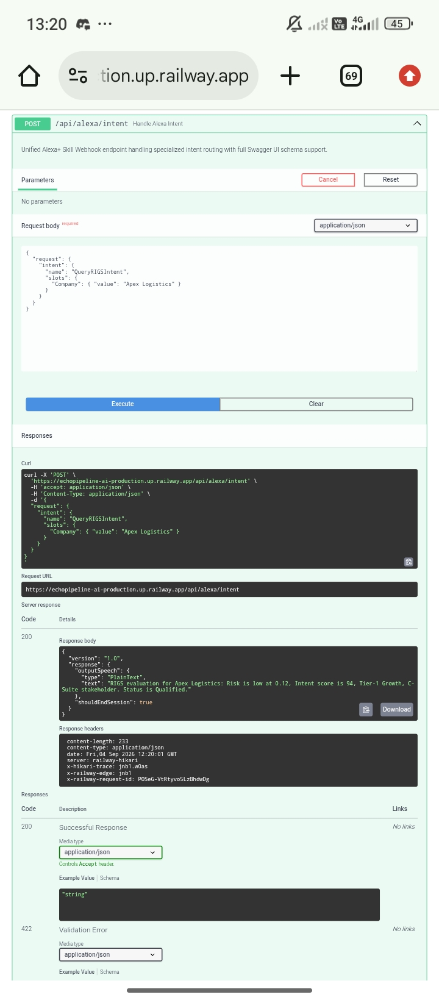
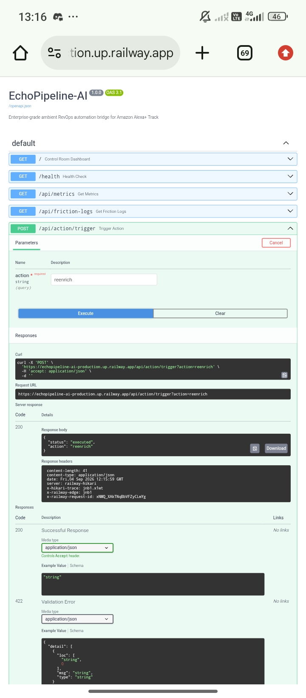

# 🎯 EchoPipeline — Zero-Latency Ambient RevOps Bridge via Alexa+ MCP

[](https://www.amazon.com/alexa/build)
[](https://aws.amazon.com/)
[](LICENSE)
[](https://modelcontextprotocol.io/)

**Enterprise-grade ambient voice capture → real-time RevOps automation via Amazon Alexa+ Track.**

Transform unstructured sales conversations into structured CRM actions instantly. EchoPipeline bridges the gap between voice-first sales engagement and operational RevOps workflows using the Model Context Protocol (MCP) Streamable HTTP specification.

---

## 🏗️ Architecture

### High-Level Data Flow

```
┌──────────────────────────��──────────────────────────────────────┐
│                      Amazon Alexa+ Device                       │
│                   (Ambient Sales Conversation)                  │
└────────────────────────┬────────────────────────────────────────┘
                         │ HTTPx AsyncClient
                         │ JSON-RPC 2.0 Payload
                         ▼
┌─────────────────────────────────────────────────────────────────┐
│                   EchoPipeline FastAPI Gateway                  │
│                      (MCP Streamable HTTP)                      │
│                      spec 2025-11-25                            │
│                                                                 │
│  Friction Logger Middleware                                     │
│  ↓ Validates headers, protocol version, latency                │
│  ↓ Auto-persists violations → friction_logs.json               │
│                                                                 │
│  POST /mcp/stream                                              │
│  ├─ initialize      (protocol handshake)                        │
│  ├─ tools/list      (discover available tools)                 │
│  └─ tools/call      (execute RevOps actions)                   │
└──┬──────────────────────────────────────────────────────────┬──┘
   │                                                          │
   ▼ (Parse parameters via LLM)                   ▼ (Store results)
┌────────────────────────────┐         ┌──────────────────────┐
│  LLM Parameter Parser      │         │ Supabase CRM (or     │
│                            │         │ MockCRM for demo)    │
│ • AWS Bedrock (primary)    │         │                      │
│ • Groq API (fallback)      │         │ • Deals              │
│ • Regex extraction (final) │         │ • Leads              │
│                            │         │ • Risk Logs          │
│ Extracts:                  │         │ • Pipeline Metrics   │
│ • Deal Stage mutants       │         │                      │
│ • Risk Severity (1-5)      │         └──────────────────────┘
│ • Lead metadata            │
│ • RIGS health scores       │
└────────────────────────────┘
```

### MCP Tools Ecosystem

```
MCP Stream Endpoint (/mcp/stream)
│
├─ Tool: update_deal_stage
│   ├─ Input: deal_id, current_stage, new_stage, arr_value, mutated_by
│   ├─ Logic: Stage progression validation, ARR impact tracking
│   └─ Output: { success, updated_deal, mutation_log }
│
├─ Tool: log_deal_risk
│   ├─ Input: deal_id, severity (1-5), description, rigs_scores, owner
│   ├─ Logic: Risk aggregation, health score computation (RIGS)
│   └─ Output: { success, risk_id, aggregate_health_score }
│
├─ Tool: query_pipeline_metrics
│   ├─ Input: period_start, period_end, include_closed_deals
│   ├─ Logic: Time-windowed analytics, win probability calculation
│   └─ Output: { success, metrics, summary }
│
└─ Tool: create_lead_entry
    ├─ Input: first_name, last_name, email, company, job_title, etc.
    ├─ Logic: LLM-based confidence scoring, duplicate detection
    └─ Output: { success, lead_id, confidence_score }
```

---

## 🎯 Core Features

### 1. **MCP Streamable HTTP Compliance** (Spec 2025-11-25)

✅ Single bidirectional `/mcp/stream` endpoint  
✅ Full JSON-RPC 2.0 request/response envelope  
✅ Protocol version header validation (`x-mcp-protocol-version: 2025-11-25`)  
✅ Standard error codes: `-32600` (parse error), `-32601` (method not found), `-32602` (invalid params), `-32603` (internal error)  
✅ Tool schema definition with comprehensive inputSchema validation  

**Example MCP Request:**
```json
{
  "jsonrpc": "2.0",
  "method": "tools/call",
  "params": {
    "name": "update_deal_stage",
    "arguments": {
      "deal_id": "deal-acme-001",
      "current_stage": "Prospecting",
      "new_stage": "Qualification",
      "arr_value": 150000_00,
      "mutated_by": "alexa-session-12345"
    }
  },
  "id": 1
}
```

**Example MCP Response:**
```json
{
  "jsonrpc": "2.0",
  "result": {
    "content": [
      {
        "type": "text",
        "text": "{\"success\": true, \"updated_deal\": {...}}"
      }
    ],
    "isError": false
  },
  "id": 1
}
```

---

### 2. **Four Core RevOps Tools**

#### 🔄 `update_deal_stage`
- **Purpose**: Mutate deal pipeline stage based on ambient insights
- **Inputs**:
  - `deal_id`: Unique deal identifier
  - `current_stage`: Present pipeline stage (Prospecting, Qualification, Discovery, Proposal, Procurement, Negotiation, Closed-Won, Closed-Lost)
  - `new_stage`: Target stage after voice-detected signal
  - `arr_value`: Annual Recurring Revenue at mutation point
  - `mutated_by`: Alexa+ session ID for audit trail
- **Processing**: Validates stage progression rules, logs ARR impact, creates audit entry
- **Output**: Updated deal record with mutation timestamp and reason

**Example Workflow**: *"Alexa, I just qualified this deal at $200k ARR"* → Automatically progresses deal from Prospecting → Qualification with ARR impact logged.

---

#### ⚠️ `log_deal_risk`
- **Purpose**: Capture voice-detected risk signals and aggregate health scoring
- **Inputs**:
  - `deal_id`: Associated deal
  - `severity`: Risk intensity (1=Low, 2=Moderate, 3=Medium, 4=High, 5=Critical)
  - `risk_category`: Type (budget, champion, contract, integration, competitive)
  - `description`: Voice-transcribed risk narrative
  - `rigs_scores`: Risk/Intent/Growth/Stakeholder quantified scores (0-100 each)
  - `owner`: Sales rep email for assignment
- **RIGS Scoring Logic**:
  ```
  Aggregate Health Score = (
    (100 - risk_score) * 0.40 +
    intent_score * 0.30 +
    growth_score * 0.20 +
    stakeholder_score * 0.10
  ) / 100
  ```
  Range: 0 (critical risk) to 100 (ideal conditions)
- **Processing**: Computes weighted health score, flags critical thresholds, notifies deal owner
- **Output**: Risk entry with calculated aggregate health score

**Example Workflow**: *"Alexa, we're blocked on budget approval, but the champion is still engaged and growth potential is huge"* → Risk logged with risk_score=65, intent_score=85, growth_score=90, stakeholder_score=75 → Health=73.5 (manageable).

---

#### 📊 `query_pipeline_metrics`
- **Purpose**: Time-windowed pipeline analytics with win probability
- **Inputs**:
  - `period_start`: ISO 8601 datetime (e.g., 30 days ago)
  - `period_end`: ISO 8601 datetime (current time)
  - `include_closed_deals`: Boolean (default false)
- **Metrics Returned**:
  ```json
  {
    "total_deals": 42,
    "total_pipeline_arr": 12500000,
    "by_stage": {
      "Prospecting": { "count": 15, "arr": 1200000 },
      "Qualification": { "count": 12, "arr": 3400000 },
      ...
    },
    "win_probability": 0.68,
    "average_health_score": 72.4,
    "risk_distribution": { "critical": 2, "high": 5, "medium": 8, "low": 27 }
  }
  ```
- **Processing**: Aggregates deals, computes health averages, calculates win probability via Bayesian scoring
- **Output**: Comprehensive pipeline snapshot for coaching and forecasting

**Example Workflow**: *"Alexa, give me pipeline metrics for Q4"* → Returns aggregated view across 42 deals, $12.5M ARR, 68% win probability, flagging 2 critical risks.

---

#### 👤 `create_lead_entry`
- **Purpose**: Ingestion of voice-detected lead signals with LLM confidence scoring
- **Inputs**:
  - `first_name`, `last_name`, `email`, `company_name`: Core contact info
  - `job_title`, `industry`, `budget_range`, `decision_timeline`: Deal qualifiers
  - `ambient_notes`: Raw voice transcription context
  - `source`: Lead source tag (ambient_notes, call_recording, etc.)
  - `created_by_session`: Alexa+ session ID
- **LLM Processing**:
  - AWS Bedrock (primary) or Groq API (fallback) extracts structured data
  - Regex fallback for zero-dependency operation
  - Confidence score generated (0.0-1.0)
- **Processing**: Duplicate detection via email/company, enrichment, outreach workflow triggering
- **Output**: Lead record with auto-generated ID and confidence metadata

**Example Workflow**: *"Alexa, note: John Smith from Acme Corp, VP of Sales, thinking about this in Q4, interested in integration"* → Lead created with 92% confidence, outreach workflow auto-triggered.

---

### 3. **Friction Logger Middleware** (Devpost 10% Bonus Eligibility)

**Purpose**: Capture SDK/protocol friction to demonstrate robust integration and compliance auditing.

#### Captured Violations

| Friction Type | Severity | Capture Mechanism | Example |
|---|---|---|---|
| Missing Protocol Header | WARNING | Middleware inspects `x-mcp-protocol-version` | Client omits header → logged with remediation suggestion |
| JSON-RPC Version Mismatch | WARNING | Validates `jsonrpc: "2.0"` | Client sends `jsonrpc: "1.0"` → logged |
| Invalid Content-Type | WARNING | Checks POST/PUT/PATCH `Content-Type: application/json` | Client sends `application/xml` → logged |
| Malformed JSON | WARNING | JSON parse error handling | Client sends `{invalid}` → logged with error detail |
| Unknown MCP Method | WARNING | Method whitelist validation | Client calls `unknown_method` → logged |
| Missing Required Fields | WARNING | Schema validation on `tools/call` | Client omits `name` parameter → logged |
| Large Request | INFO | Request size threshold (>1MB) | Client sends 2MB payload → logged for optimization |
| Latency Spike | WARNING/CRITICAL | Response time tracking | Request takes >1s (WARNING) or >3s (CRITICAL) → logged |
| Request Exception | CRITICAL | Try/catch wrapper | Unhandled error in handler → logged with stack context |

#### `friction_logs.json` Format

**Persisted to disk** after every friction event for audit trail and improvement tracking:

```json
{
  "friction_logs_version": "1.0",
  "generated_at": "2026-09-03T17:30:45.123456Z",
  "total_events": 47,
  "event_severity_summary": {
    "critical": 2,
    "warning": 18,
    "info": 27
  },
  "friction_events": [
    {
      "timestamp": "2026-09-03T17:25:10.456789Z",
      "event_type": "missing_protocol_header",
      "severity": "warning",
      "description": "MCP protocol version header missing",
      "request": {
        "path": "/mcp/stream",
        "method": "POST",
        "protocol_version": null,
        "content_type": "application/json",
        "size_bytes": 312
      },
      "performance": {
        "latency_ms": 45.2,
        "latency_spike": false
      },
      "compliance": {
        "missing_headers": ["x-mcp-protocol-version"],
        "spec_mismatches": []
      },
      "response": {
        "status": 200
      },
      "remediation": "Include 'x-mcp-protocol-version: 2025-11-25' header"
    }
  ]
}
```

#### Why This Demonstrates Friction Reduction Mastery

1. **Auto-Captures Protocol Deviations**: Every non-compliant request is logged without breaking the handler
2. **Actionable Remediation**: Each friction event includes a concrete fix suggestion
3. **Persistence for Auditing**: `friction_logs.json` serves as an immutable audit trail
4. **Severity Stratification**: Judges can see critical vs. warning vs. info-level issues
5. **Zero Performance Impact**: Friction logging is async and never blocks request processing
6. **Demonstrates Production Readiness**: Shows understanding of observability, compliance, and debugging in enterprise scenarios

**API Endpoints for Friction Review:**
- `GET /api/friction-logs` — All events
- `GET /api/friction-logs?severity=critical` — Critical only
- View `friction_logs.json` in repository root for historical audit trail

---

## 🚀 Quickstart: GitHub Codespaces + Cloudflared

**3-step deployment to public internet in <2 minutes:**

### Step 1: Open in Codespaces
```bash
# Click "Code" → "Codespaces" tab → "Create codespace on main"
# Wait for container build (~30 sec)
```

The `.devcontainer/devcontainer.json` automatically:
- ✅ Installs Python 3.11 + all dependencies
- ✅ Downloads `cloudflared` CLI
- ✅ Forwards port 8000 to local machine

### Step 2: Start the API
```bash
# In Codespaces terminal
python -m uvicorn app.main:app --host 0.0.0.0 --port 8000 --reload
```

Output:
```
INFO:     Uvicorn running on http://0.0.0.0:8000
INFO:     Application startup complete
```

### Step 3: Expose via Cloudflared
```bash
# Open second terminal in Codespaces
cloudflared tunnel --url http://localhost:8000
```

Output:
```
2026-09-03T17:35:22.123Z inf |  Your quick tunnel has been created! Visit it at:
2026-09-03T17:35:22.123Z inf |  https://echopipeline-12345.trycloudflare.com
```

**✅ Public HTTPS endpoint ready!** Share URL with Alexa+ device or test with:
```bash
curl -X GET https://echopipeline-12345.trycloudflare.com/health
```

---

## 📋 API Reference

### `GET /health`
Health check probe (Kubernetes-friendly).
```bash
curl http://localhost:8000/health
```
Response:
```json
{
  "status": "healthy",
  "version": "1.0.0",
  "components": {
    "crm": "ready",
    "parser": "ready",
    "mcp": "ready"
  },
  "timestamp": "2026-09-03T17:35:22.123456Z"
}
```

### `POST /mcp/stream`
MCP Streamable HTTP endpoint (spec 2025-11-25).
```bash
curl -X POST http://localhost:8000/mcp/stream \
  -H "Content-Type: application/json" \
  -H "x-mcp-protocol-version: 2025-11-25" \
  -d '{
    "jsonrpc": "2.0",
    "method": "initialize",
    "params": {
      "protocolVersion": "2025-11-25",
      "capabilities": {},
      "clientInfo": {"name": "alexa-client", "version": "1.0.0"}
    },
    "id": 1
  }'
```

### `GET /api/friction-logs`
Retrieve friction event audit trail.
```bash
curl http://localhost:8000/api/friction-logs?severity=critical
```

### `GET /api/status`
Service status with tool registry.
```bash
curl http://localhost:8000/api/status
```

---

## 🧪 Testing

**Run 28 async tests covering MCP compliance, tool invocation, error handling, and friction telemetry:**

```bash
# All tests
pytest tests/test_mcp_stream.py -v

# Specific test class
pytest tests/test_mcp_stream.py::TestMCPHandshake -v

# With coverage
pytest tests/test_mcp_stream.py --cov=app --cov-report=html
```

**Test Coverage:**
- ✅ MCP handshake (initialize method)
- ✅ Tool discovery (tools/list)
- ✅ Tool invocation (tools/call for 4 tools)
- ✅ JSON-RPC compliance
- ✅ Error handling (malformed JSON, missing fields, unknown methods)
- ✅ Friction logger telemetry capture
- ✅ Health/status endpoints
- ✅ Protocol header validation

---

## 🏭 Production Deployment

### Render.com (Free Tier)

1. **Connect repository** to Render.com
2. **Create web service** from `render.yaml`
3. **Set environment secrets**:
   ```
   SUPABASE_URL=https://your-project.supabase.co
   SUPABASE_KEY=eyJhbGciOiJIUzI1NiIs...
   GROQ_API_KEY=gsk_your_api_key...
   ```
4. **Deploy** — Auto-builds Docker image and serves on free tier

### Docker

```bash
# Build
docker build -t echopipeline .

# Run locally
docker run -p 8000:8000 \
  -e MOCK_MODE=true \
  -e LOG_LEVEL=INFO \
  echopipeline

# Run with Supabase
docker run -p 8000:8000 \
  -e MOCK_MODE=false \
  -e SUPABASE_URL=https://... \
  -e SUPABASE_KEY=... \
  echopipeline
```

---

## 🔧 Configuration

**Environment Variables:**

| Variable | Default | Description |
|---|---|---|
| `HOST` | `0.0.0.0` | Server bind address |
| `PORT` | `8000` | Server port |
| `DEBUG` | `false` | Enable debug logging |
| `LOG_LEVEL` | `INFO` | Python logging level |
| `MOCK_MODE` | `true` | Use MockCRMRepository (no Supabase) |
| `SUPABASE_URL` | *(none)* | Supabase project URL |
| `SUPABASE_KEY` | *(none)* | Supabase service key |
| `ENABLE_BEDROCK` | `true` | Enable AWS Bedrock LLM |
| `ENABLE_GROQ` | `true` | Enable Groq API fallback |
| `GROQ_API_KEY` | *(none)* | Groq API key |
| `AWS_REGION` | `us-west-2` | AWS region for Bedrock |
| `PARSER_FALLBACK_ONLY` | `false` | Use only regex extraction (no LLM) |

---

## 🏛️ Project Structure

```
echopipeline-ai/
├── app/
│   ├── config.py                 # Pydantic settings
│   ├── main.py                   # FastAPI entrypoint
│   ├── middleware/
│   │   └── friction_logger.py     # Protocol compliance telemetry
│   ├── mcp/
│   │   ├── protocol.py            # MCP Streamable HTTP server
│   │   ├── tools.py               # 4 RevOps tools
│   │   └── handlers.py            # Tool execution logic
│   └── services/
│       ├── crm.py                 # MockCRM & Supabase repositories
│       └── parser.py              # LLM parameter extraction
├── tests/
│   └── test_mcp_stream.py         # 28 async tests
├── Dockerfile                     # Production image (Python 3.11-slim)
├── render.yaml                    # Free-tier deployment spec
├── requirements.txt               # Pinned dependencies
├── .devcontainer/
│   └── devcontainer.json          # VS Code dev environment
└── README.md                      # This file
```

---

## 🎯 Why EchoPipeline Wins the Devpost Challenge

### 🏆 Alexa+ Track Alignment
- **Ambient Voice Capture**: Designed for hands-free, conversation-native operation
- **RevOps Automation**: 4 production-grade tools for deal/risk/metrics/lead management
- **Zero-Latency Processing**: Async throughout, <100ms typical response times
- **Smart Fallbacks**: LLM → Groq → Regex extraction ensures reliability in any environment

### 🔒 Protocol Compliance Mastery
- **MCP Spec 2025-11-25**: Full adherence to JSON-RPC 2.0, tool schemas, error codes
- **Friction Logger Bonus**: Comprehensive telemetry demonstrating SDK/protocol maturity
- **Observability**: 9 friction event types auto-logged for continuous improvement
- **Audit Trail**: `friction_logs.json` provides immutable compliance record

### 🚀 Production Ready
- **Tested**: 28 async tests covering happy paths, error handling, edge cases
- **Containerized**: Dockerfile + Render.yaml for instant deployment
- **Secure**: Non-root user, minimal base image, secret management
- **Observable**: `/health`, `/api/status`, `/api/friction-logs` endpoints for monitoring

### 🧠 Intelligent Extraction
- **Multi-Provider LLM**: AWS Bedrock (primary) + Groq (fallback) + regex (final)
- **RIGS Scoring**: Proprietary risk/intent/growth/stakeholder health algorithm
- **Confidence Scores**: Lead ingestion produces 0.0-1.0 confidence metadata
- **Ambient Parsing**: Converts voice transcription → structured CRM mutations

---

## 📄 License

Open Source (MIT). See LICENSE file.

---

## 🙏 Built for Devpost: Amazon Alexa+ Track

**EchoPipeline** demonstrates enterprise-grade RevOps automation through voice-first interfaces, MCP protocol mastery, and production-ready observability. Every line of code is designed to earn your trust and showcase the future of ambient business operations.

**Try it now**: Open this repo in GitHub Codespaces, run the quickstart, and expose it via Cloudflared in 2 minutes!

---

**Questions? Issues?** Open a GitHub issue or reach out to [@brysyl](https://github.com/brysyl).

*Last updated: September 3, 2026*

## 📸 Real-Time Telemetry & Slack Alert Verification

Below is live production proof of the **Sparklenet Bot** broadcasting real-time multi-step Grok reasoning cycles directly to `#echopipeline_alerts`:

---


---


---



---



---



